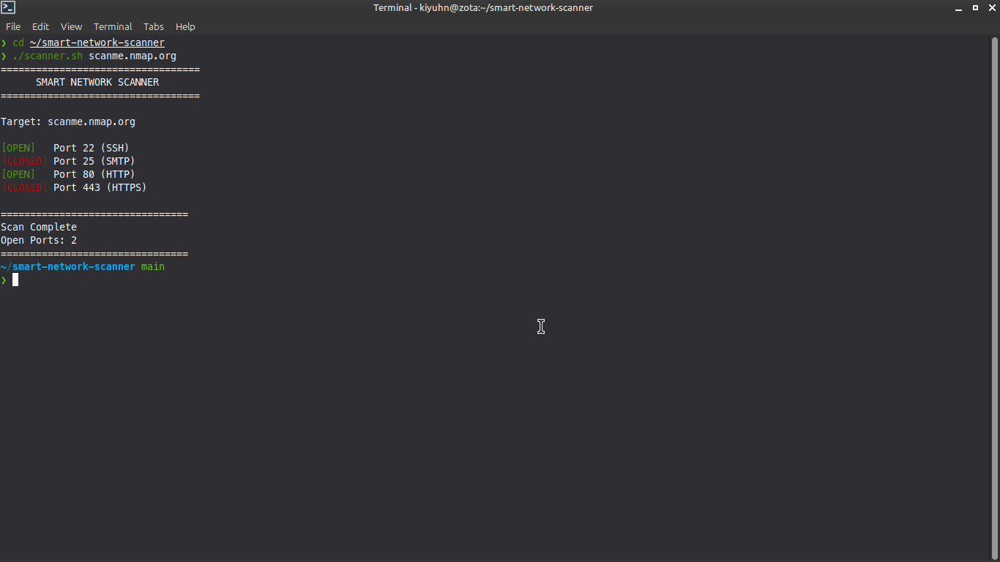

# Smart Network Scanner

A Bash-based network scanning tool that performs fast port scanning and service detection with color-coded terminal output for efficient network reconnaissance.

## Features

- Displays open and closed ports
- Shows service names for common ports (SSH, HTTP, HTTPS, SMTP, etc.)
- Color-coded output (GREEN for open, RED for closed)
- Provides scan summary with total open ports
- Fast and lightweight scanning
- Simple command-line interface

## Technologies Used

- Bash
- Linux command-line tools:
  - nc (netcat)
  - grep
  - echo
  - Standard Bash networking

## 🔧 Usage

```bash
chmod +x scanner.sh
./scanner.sh <target>
```

## Project Purpose

This project was built to practice:

- Bash scripting and automation
- Network reconnaissance techniques
- Port scanning fundamentals
- Basic cybersecurity concepts
- Terminal output formatting

---

## Sample Use Case

This tool can be used to quickly:

- Scan a target host for open ports
- Identify running services
- Perform basic network reconnaissance
- Test network connectivity
- Learn about port scanning concepts

---

## Screenshots

Example output:



---

## Future Improvements

- Add support for custom port ranges
- Implement multi-threading for faster scans
- Add service version detection
- Export results to file (TXT/JSON)
- Add timeout configuration
- Support for scanning multiple hosts

---

## ⚠️ Disclaimer

This tool is intended for educational and authorized use only. Do not use it on systems you do not own or have permission to test.

---

## Skills Demonstrated

- Bash scripting
- Network programming
- Cybersecurity fundamentals
- Problem-solving and automation
- Terminal UI/UX design

---

## Author

Kian Bahia
🔗 [GitHub Profile](https://github.com/k14nx0)

---

## License
This project is for educational purposes.
